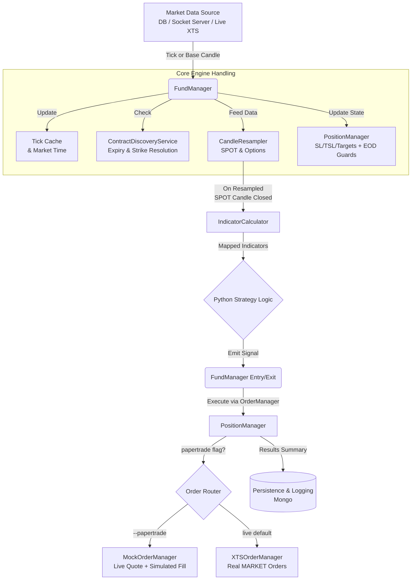
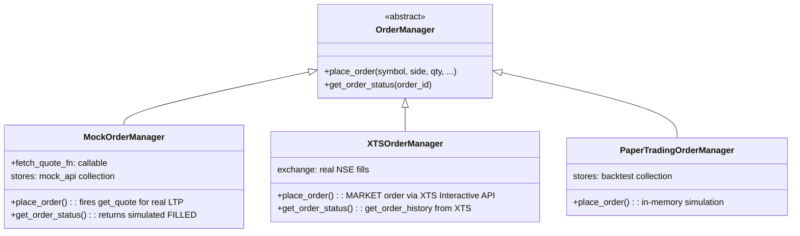
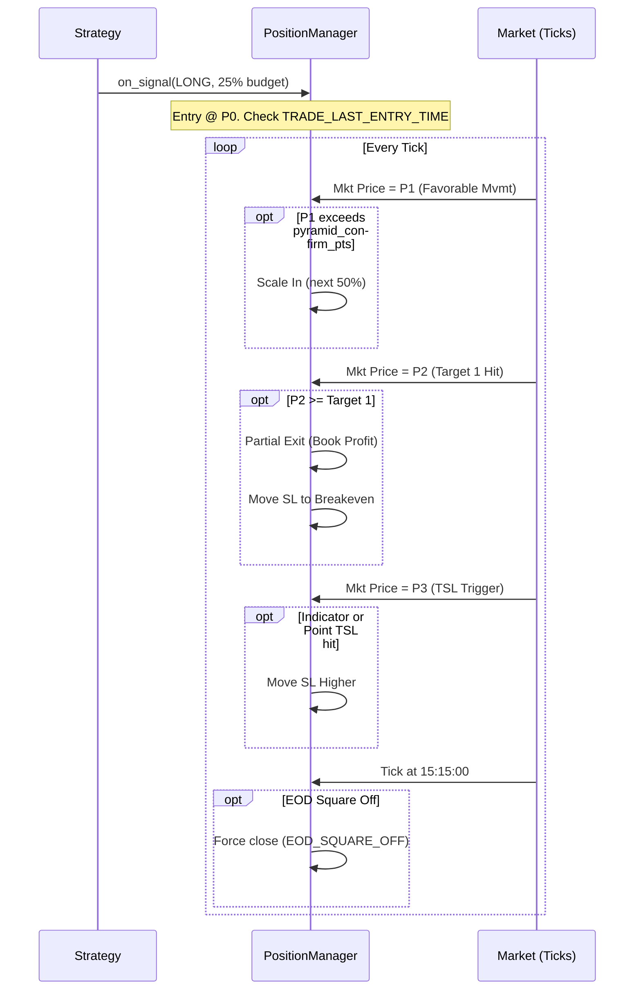

## Functional & Code Explanation

This document provides a **conceptual walkthrough** of how the core engine works, mapping major functional pieces to concrete modules and classes in the codebase. It reflects the current production architecture including papertrade/live execution split, EOD safety controls, and explicit expiry‑day rollover logic.

---

## 1. End‑to‑End Flow: From Data to Trades

At a high level, whether backtesting or live trading, the system processes raw data into executed trades through a continuous pipeline:



1. **Data source** provides raw market data:
   - DB cursor over `nifty_candle` / `options_candle` (backtest DB mode).
   - Socket simulator (`packages/simulator/socket_server.py`) (backtest socket mode).
   - XTS sockets via `LiveTradeEngine` (live mode).
2. Each tick or base candle is passed into `FundManager.on_tick_or_base_candle(market_data: dict)`.
3. `FundManager`:
   - Updates **tick cache** and global market time.
   - Feeds data to **CandleResampler** instances for SPOT and options.
   - Updates **PositionManager** with price and mapped indicators to maintain SL/TSL/targets.
   - On resampled SPOT candle close:
     - Recomputes indicators via **IndicatorCalculator**.
     - Calls **Python strategy logic**.
     - Executes entry/exit decisions using `PositionManager`.
4. `PositionManager` enforces all **EOD time guards** on every tick and routes execution to either `MockOrderManager` or `XTSOrderManager` based on the `papertrade` flag.
5. Results (trades, events, session summaries) are:
   - Logged to console (through `log_utils` and `trade_formatter`).
   - Persisted to Mongo (`livetrade`, `mock_api`).

---

### 1.1 Events and Inter‑Module Communication

The core engine relies on two primary mechanisms of data progression: **Tick Events** and **Candle Close Events**.

#### Tick Events vs Candle Close Events
- **Tick Event (`on_tick_or_base_candle`)**: Every single piece of lowest-granularity data triggers this event. In Live mode, this is a literal XTS trade stream tick. In backtesting, this is usually a 1-minute historical DB candle. The primary actions here are:
  - Validating contract drift.
  - Updating the `PositionManager` with real-time instrument prices so SL and Target hits can be evaluated dynamically, *intra-candle*.
  - Checking EOD time guards (`TRADE_SQUARE_OFF_TIME`).
  - Handing the data chunk into the `CandleResampler`.
- **Candle Close Event (`_on_resampled_candle_closed`)**: Triggers far less frequently — only when the `CandleResampler` observes that accumulated ticks have crossed the boundary of its higher timeframe (e.g., forming a complete 3-minute candle).
  - This is the **decision point** of the engine.
  - Indicators are computed ONLY on a candle close event.
  - The Python Strategy file is executed ONLY on a candle close event.
  - Checks `TRADE_LAST_ENTRY_TIME` before allowing new entries.

#### Candle Accumulation and Calculation
The `CandleResampler` continuously groups incoming ticks by their timestamp slice. It delays finalizing a candle until the incoming market time exceeds the current `interval_seconds` bucket. Once finalized, these OHLCV values form a definitive historical bar pushed to the `IndicatorCalculator`.

#### Full Warmup vs. Incremental Ticks
- **Full Historical Warmup**: Before handling active signals, the engine requires a trailing history buffer to make indicators like EMA computationally stable. `MarketHistoryService` fetches bulk past candles and pushes them through the resampler. During this phase, `FundManager.is_warming_up = True`, meaning all signals are discarded.
- **Incremental Live Ticks**: Once the buffer is loaded, live playback begins. The engine applies active processing and acts upon signals generated at candle close.

---

### 1.2 Example: Single LONG Trade Lifecycle

1. **Warm‑up**
   - `MarketHistoryService` feeds past candles into `CandleResampler` and `IndicatorCalculator`.
   - `FundManager.is_warming_up = True` → signals ignored.
2. **First valid SPOT candle close**
   - Resampled SPOT candle closes; `_on_resampled_candle_closed` is called.
   - Indicators are recalculated and mapped (`active-*`, `inverse-*`).
   - Strategy emits `SignalType.LONG`.
   - **`TRADE_LAST_ENTRY_TIME` check**: If candle timestamp is `>= 15:00`, the entry is blocked.
3. **Entry**
   - `FundManager` determines direction intent and target instrument.
   - `ContractDiscoveryService.resolve_option_contract` resolves the exact instrument ID:
     - **Expiry Jump Rule**: If today is expiry day and the candle timestamp is `>= TRADE_EXPIRY_JUMP_CUTOFF` (default `14:30`), execution shifts to the Next Week contract automatically.
   - Entry price pulled from live tick cache or `get_quote` fallback.
   - `PositionManager.on_signal` is called with the resolved symbol, price, and intent.
   - **Order Manager routes**:
     - `--papertrade` → `MockOrderManager` fires `get_quote` for real LTP, simulates fill & records to `mock_api`.
     - live default → `XTSOrderManager` fires a real `MARKET` order via XTS Interactive API.
4. **Active Position Management**
   - Every relevant tick calls `PositionManager.update_tick`.
   - **`TRADE_SQUARE_OFF_TIME` check**: If tick timestamp is `>= 15:15`, the position is force-closed with reason `EOD_SQUARE_OFF`.
   - `PositionManager` applies BE move, trailing SL, indicator-based TSL.
5. **Exit**
   - Triggered by: strategy `EXIT`/flip signal, SL/TSL/target hit, or `EOD_SQUARE_OFF`.
   - On exit:
     - `PositionManager._close_position` finalizes trade.
     - `MockOrderManager` or `XTSOrderManager` executes the SELL.
     - Persistence to Mongo (`livetrade`, `mock_api`).

This lifecycle is **identical** across backtests and live trading; only the **source** of ticks/candles and the **order manager** differ.

---

## 2. Candle Resampling (Timeframe Logic)

### 2.1 Responsibility

Module: `packages/tradeflow/candle_resampler.py`  
Class: `CandleResampler`

**Goal**: Convert smaller timeframe candles or ticks into the higher‑level timeframe used by the strategy (e.g., 3‑minute bars for Triple Lock).

### 2.2 How It Works

- Constructed with:
  - `instrument_id`
  - `interval_seconds` (e.g., 180 for 3‑minute candles).
  - `on_candle_closed` callback (usually a method on `FundManager`).
- For each incoming candle (or normalized tick):
  - Computes the period start:
    - `period_start = (timestamp // interval_seconds) * interval_seconds`
  - If `period_start` differs from the previous one:
    - Closes the current aggregated candle (sets `is_final=True`).
    - Invokes `on_candle_closed(closed_candle)`.
    - Starts a new candle for the new period.
  - Aggregates open/high/low/close/volume into the current candle.

---

## 3. Indicator Calculation

### 3.1 Responsibility

Module: `packages/tradeflow/indicator_calculator.py`  
Class: `IndicatorCalculator`

**Goal**: Compute and maintain **rolling technical indicators** for SPOT and options, using vectorized operations (Polars).

### 3.2 Inputs

- `indicators_config`: list of indicator definitions from `strategy_indicator` collection.
  - Each config typically has:
    - `indicatorId`: logical name (e.g., `fast_ema`).
    - `indicator`: shorthand (e.g., `ema-5`, `rsi-14`, `supertrend-10-3`).
    - `InstrumentType`: one of `SPOT`, `CE`, `PE`, `OPTIONS_BOTH`.

### 3.3 Internal State

- `instrument_candles`: `dict[instrument_id -> deque[candles]]` (rolling windows).
- `active_instrument_ids`: `dict[InstrumentCategoryType -> instrument_id]`.
- `latest_results`: cached latest results per instrument.

### 3.4 Calculation Flow

When `add_candle` is called:

1. Assign or infer `instrument_id` and `instrument_category`.
2. Append the normalized candle to a deque for that `instrument_id`.
3. Create a Polars `DataFrame` from the deque.
4. Filter `indicators_config` for rules matching this category.
5. For each relevant indicator: parse `indicator_str` and calculate it.
6. Extract **last row** (and previous row) for each indicator key with category prefix.
7. Store results in `latest_results[instrument_id]`.

### 3.5 Supported Shorthands

- `ema-N`, `sma-N`, `rsi-N`, `atr-N`
- `supertrend-period-multiplier`
- `macd-fast-slow-signal`, `bbands-period-multiplier`
- `vwap`, `obv`, `price`

### 3.6 Indicator Anti-Stale Rule

The indicator calculator is invalidated across session gaps (overnight). A candle arriving with a timestamp that represents a new calendar day after a gap will reset the indicator state to prevent previous-session momentum from leaking into fresh intraday signals.

---

## 4. Fund Manager (Core Brain)

### 4.1 Responsibility

Module: `packages/tradeflow/fund_manager.py`  
Class: `FundManager`

**Goal**: Coordinate everything:

- Strategy config and indicators.
- Contract drift and active instruments.
- Candle resampling and indicator updates.
- Strategy signal evaluation.
- Position and order management.
- EOD handling and safety checks.

### 4.2 Construction

The constructor receives:

- `strategy_config`: normalized strategy document (from `TradeConfigService`).
- `position_config`: budget, SL/TSL, targets, pyramiding, instrument type, `python_strategy_path`, `papertrade` flag.
- Optional services: `config_service`, `discovery_service`, `history_service`.

It then:

1. Normalizes configs and builds `IndicatorCalculator`, `PositionManager`.
2. Reads `papertrade` from `position_config` and instantiates the correct `OrderManager`:
   - `True` → `MockOrderManager(fetch_quote_fn=...)` for simulated fills with real LTP.
   - `False` (default) → `XTSOrderManager()` for real MARKET orders.
3. Loads the Python strategy using `PythonStrategy` and `python_strategy_path`.
4. Sets up `ContractDiscoveryService` to track current SPOT/CE/PE instruments.
5. Prepares indicator mapping cache: raw indicators → mapped `active-*` / `inverse-*` views.

### 4.3 Tick / Candle Handling

`on_tick_or_base_candle(market_data: dict)`:

1. Determines `inst_id`, `timestamp`, and whether this is SPOT or option.
2. Updates `latest_market_time` and tick cache.
3. Normalizes OHLC for pure ticks (if only `p` is present).
4. For SPOT ticks: triggers strike resolution via `ContractDiscoveryService`.
5. If a position is open: updates `PositionManager` (tick-level SL/TSL/target checks and EOD square-off).
6. Routes data to relevant `CandleResampler`.
7. On resampled SPOT candle close: calls `_on_resampled_candle_closed`.

### 4.4 Indicator Mapping (Active/Inverse)

`_get_mapped_indicators`:

1. Pulls SPOT (`nifty-*`), CE (`ce-*`), and PE (`pe-*`) indicator values.
2. Based on current position direction, applies `_apply_active_inverse_mapping`:
   - Active side (e.g., CE when long) gets `active-*` prefix.
   - Opposite side (PE) gets `inverse-*` prefix.

### 4.5 Signal Handling & Entry Guards

`_on_resampled_candle_closed`:

1. Calls strategy: `(signal, reason, confidence)`.
2. Ignores signals during warm‑up.
3. Handles exit signals, flip signals, and fresh entries.
4. **`TRADE_LAST_ENTRY_TIME` guard** (inside `PositionManager.on_signal`): if new entry timestamp is `>= 15:00`, the entry is rejected with log `🛑 Late Day Block`.
5. Calculates **entry price** for options using `_get_fallback_option_price`.
6. Builds a `SignalPayload` and delegates to `PositionManager.on_signal`.

---

## 5. Contract Discovery & Expiry Rollover

### 5.1 Responsibility

Module: `packages/services/contract_discovery.py`  
Class: `ContractDiscoveryService`

**Goal**: Resolve which exact exchange instrument ID to trade, given a spot price, strike selection, and current time.

### 5.2 Explicit Expiry Day Rollover

When `resolve_option_contract` is called:

1. All expiry dates for the symbol are retrieved from the cache or DB starting from midnight today.
2. The **nearest expiry date** is determined.
3. **Expiry Jump Rule**:
   - If `nearest_expiry_date == today` **AND** `current_time >= TRADE_EXPIRY_JUMP_CUTOFF` (default `14:30`):
     - The `target_expiry` is explicitly set to the **second nearest expiry** (Next Week).
     - Log: `⏭️ Expiry Jump Triggered! Switching to Next Week: <date>`
   - Otherwise: target remains the current week.
4. The instrument is fetched using an exact equality match on `target_expiry` (no implicit overflow).

> [!IMPORTANT]
> EMA signals are always computed on the **Current Week** contract (tracking via `DriftManager`). Only **execution** jumps to Next Week after the cutoff. This means your momentum indicators are always based on liquid, well-followed premium data, while you avoid Theta/Gamma explosions at expiry.

### 5.3 ATM Strike Drift

When SPOT price shifts significantly, the ATM strike updates:

- `get_atm_strike(spot_price, step=50)` rounds spot to the nearest multiple of 50.
- `get_target_strike` resolves `ATM`, `ITM-x`, or `OTM-x` from the computed ATM with iterative fallback towards ATM if the requested strike has no active contract.

---

## 6. Position & Order Management

### 6.1 PositionManager

Module: `packages/tradeflow/position_manager.py`

**Goal**: Convert signals and tick updates into a **single open position** at a time with SL/TSL enforcement, targets, partial exits, and pyramiding.

#### Time Guards (All in `PositionManager`)

| Guard | Location | Behavior |
|-------|----------|----------|
| `TRADE_START_TIME` (`09:20`) | `on_signal` | Ignores signals before market opens |
| `TRADE_LAST_ENTRY_TIME` (`15:00`) | `on_signal` — new entry block | Rejects new LONG/SHORT entries; exits still work |
| `TRADE_SQUARE_OFF_TIME` (`15:15`) | `update_tick` | Force-closes any open position with `EOD_SQUARE_OFF` |

### 6.2 Order Manager Architecture



**Selection logic in `FundManager.__init__`:**

```
is_backtest=True  →  PaperTradingOrderManager  (or MockOrderManager if USE_MOCK_ORDER_MANAGER)
papertrade=True   →  MockOrderManager(fetch_quote_fn=get_quote)
papertrade=False  →  XTSOrderManager  (REAL MONEY)
```

#### MockOrderManager Behavior (Papertrade)

When `place_order` is called:
1. Fires `get_quote(segment, instrument_id)` via XTS market API to retrieve the **real-time LTP**.
2. Uses that exact LTP as the `OrderAverageTradedPrice` (simulated fill).
3. Persists the full mock order lifecycle to the `mock_api` MongoDB collection.
4. This eliminates the "stale data" problem where a historical fallback price would be used instead of the actual current market price.

#### XTSOrderManager Behavior (Live)

When `place_order` is called:
1. Submits a `MARKET` order to the XTS Interactive API.
2. Returns the `AppOrderID`.

When `get_order_status` is called:
1. Fetches `get_order_history(AppOrderID)` from XTS.
2. Reads `OrderAverageTradedPrice` from the final filled state (the true exchange fill price).
3. Returns this to `PositionManager` for accurate PnL calculation.

### 6.3 Example: Multi‑Target Pyramid Trade



---

## 7. Strategies (Python Code)

### 7.1 Base Strategy Interface

Module: `packages/tradeflow/base_strategy.py`

- `on_resampled_candle_closed(candle, indicators, current_position_intent)`
- Returns: `(SignalType, reason_str, confidence_float)`

### 7.2 Triple Lock Strategy

Module: `packages/tradeflow/python_strategies.py`  
Class: `TripleLockStrategy`

Entry conditions (CALL):
- `ce_fast > ce_slow` (CE EMA crossover).
- `spot_fast > spot_slow` (NIFTY confirmation).
- `pe_fast < pe_slow` (PE inverse confirmation).

Entry conditions (PUT):
- `pe_fast > pe_slow` (PE EMA crossover).
- `spot_fast < spot_slow` (NIFTY confirmation).
- `ce_fast < ce_slow` (CE inverse confirmation).

Exit:
- Reverse crossover on the traded instrument.

Gap Protection:
- Crossovers generated before `TRADE_START_TIME` (09:20) are ignored, preventing gap-induced entries.

### 7.3 Dynamic Loading

Module: `packages/tradeflow/python_strategy_loader.py`  
Class: `PythonStrategy`

- Accepts `script_path` in format `path/to/file.py:ClassName`.
- Dynamically imports and instantiates the class.
- Allows changing strategies by updating DB config, without touching engine code.

---

## 8. Services & Utilities

### 8.1 TradeConfigService

Module: `packages/services/trade_config_service.py`

- Loads strategy documents from Mongo.
- Normalizes them into `strategy_config` and `position_config`.

### 8.2 MarketHistoryService

Module: `packages/services/market_history.py`

- Provides candles to the engine for warm‑up and fallback prices.
- Combines Mongo queries with XTS Historical API calls.

### 8.3 ContractDiscoveryService

Module: `packages/services/contract_discovery.py`

- Tracks active SPOT/CE/PE instruments.
- Implements **explicit expiry‑day rollover** (see Section 5.2).
- Computes `get_atm_strike`, `get_target_strike`, `resolve_option_contract`.

### 8.4 TradeEventService

Module: `packages/services/trade_event.py`

- Mandatory (non-optional) granular trade lifecycle recording.
- Every session — papertrade or live — writes full events to MongoDB.
- Removed: old `record_papertrade` flag. Recording is now always enabled.

### 8.5 DateUtils, ReplayUtils, TradeFormatter

- `packages/utils/date_utils.py`: Market calendars and timestamp conversions.
- `packages/utils/replay_utils.py`: Explode OHLC bars into virtual ticks for realistic backtests.
- `packages/utils/trade_formatter.py`: Pretty formatting of heartbeats, signals, and trades.

---

## 9. CLI Integration Summary

Module: `apps/cli/main.py`

The CLI is a thin wrapper around all of this:

### Live Trade Command

```bash
python apps/cli/main.py live-trade [options]
```

| Flag | Effect |
|------|--------|
| `--papertrade` | Uses `MockOrderManager` (live quotes, no real orders) |
| *(absent)* | Uses `XTSOrderManager` (real MARKET orders) |
| `--mock <date>` | Replays historical data via socket simulator |
| `--strategy-id` | Loads strategy + indicators from DB |
| `--budget` | Capital (`200000-inr` or `10-lots`) |
| `--sl-pct` | Stop loss as % of entry |
| `--target-pct` | Comma-separated profit targets |
| `--tsl-pct` | Trailing stop loss % |
| `--use-be` | Move SL to entry after T1 |
| `--tsl-id` | Indicator-based trailing SL ID |

### Backtest Command

```bash
python apps/cli/main.py backtest [options]
```

- Gathers parameters via flags / interactive prompts.
- Calls `TradeConfigService` to fetch strategy config.
- Constructs a command for `tests.backtest.backtest_runner`.
- Always uses `PaperTradingOrderManager` (in-memory simulation).

### Data Management

- `update_master`, `sync_history`, `age_out`, `check_gaps`, `fill_gaps`.
- `seed_strategies`, `refresh_contracts`, `ensure_indexes`.

---

## 10. Key Configuration Settings

Settings are defined in `packages/settings.py` and overridden via `.env`:

| Setting | Default | Description |
|---------|---------|-------------|
| `TRADE_START_TIME` | `09:20:00` | No signals before this time |
| `TRADE_LAST_ENTRY_TIME` | `15:00:00` | Block new entries after this time |
| `TRADE_SQUARE_OFF_TIME` | `15:15:00` | Force-close all open positions |
| `TRADE_EXPIRY_JUMP_CUTOFF` | `14:30:00` | Jump to next week contract on expiry day |
| `TRADE_STOP_LOSS_PCT` | `4.0` | Default stop loss % of entry |
| `TRADE_TARGET_PCT_STEPS` | `"3"` | Default target % |
| `TRADE_TSL_PCT` | `0.5` | Default trailing SL % |
| `TRADE_TSL_ID` | `trade-ema-5` | Default TSL indicator |
| `TRADE_USE_BE` | `True` | Enable break-even move |
| `TRADE_BUDGET` | `200000-inr` | Default capital |
| `TRADE_STRIKE_SELECTION` | `ATM` | Default strike type |
| `GLOBAL_WARMUP_CANDLES` | `250` | History bars to prime indicators |
| `NIFTY_LOT_SIZE` | `65` | Shares per lot |
| `NIFTY_STRIKE_STEP` | `50` | Strike interval |
