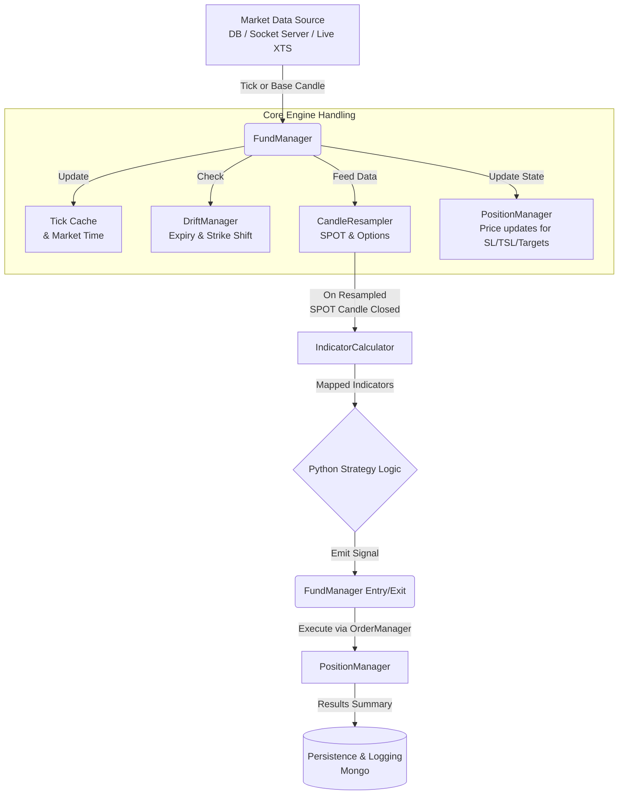
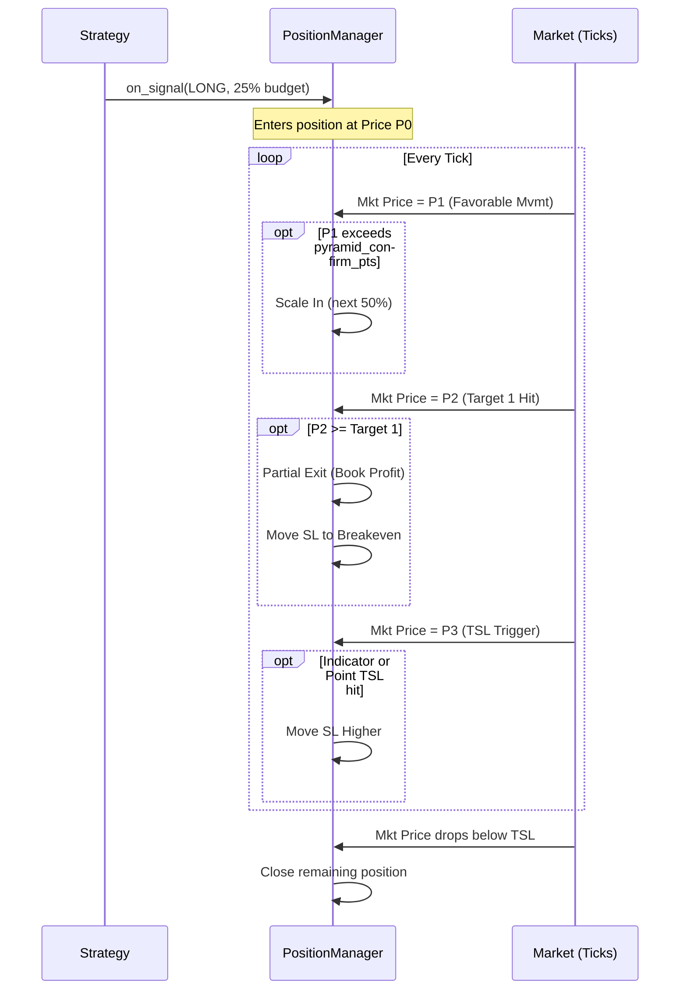

## Functional & Code Explanation

This document provides a **conceptual walkthrough** of how the core engine works, mapping major functional pieces (indicator calculation, candle resampling, fund manager, etc.) to concrete modules and classes in the codebase.

---

## 1. End‑to‑End Flow: From Data to Trades

At a high level, whether you are backtesting or live trading, the system processes raw data into executed trades through a continuous pipeline:

1. **Data source** provides raw market data:
   - DB cursor over `nifty_candle` / `options_candle` (backtest DB mode).
   - Socket simulator (`packages/simulator/socket_server.py`) (backtest socket mode).
   - XTS sockets via `LiveTradeEngine` (live mode).
2. Each tick or base candle is passed into:
   - `FundManager.on_tick_or_base_candle(market_data: dict)`.
3. `FundManager`:
   - Updates **tick cache** and global market time.
   - Feeds data to **CandleResampler** instances for SPOT and options.
   - Updates **PositionManager** with price and mapped indicators to maintain SL/TSL/targets.
   - On resampled SPOT candle close:
     - Recomputes indicators via **IndicatorCalculator**.
     - Calls **Python strategy logic**.
     - Executes entry/exit decisions using `PositionManager` and `PaperTradingOrderManager`.
4. Results (trades, papertrade events, session summaries) are:
   - Logged to console (through `log_utils` and `trade_formatter`).
   - Optionally persisted to Mongo (`trade_persistence`, `papertrade`, `livetrade`).

---

### 1.1 Events and Inter-Module Communication

The core engine relies on two primary mechanisms of data progression: **Tick Events** and **Candle Close Events**.

#### Tick Events vs Candle Close Events
- **Tick Event (`on_tick_or_base_candle`)**: Every single piece of lowest-granularity data triggers this event. In Live mode, this is a literal XTS trade stream tick. In backtesting, this is usually a 1-minute historical DB candle (which is then exploded into multiple 'virtual ticks' for high fidelity simulation). The primary actions here are:
  - Validating contract drift.
  - Updating the `PositionManager` with real-time instrument prices so SL and Target hits can be evaluated dynamically, *intra-candle*.
  - Handing the data chunk into the `CandleResampler`.
- **Candle Close Event (`_on_resampled_candle_closed`)**: This triggers far less frequently—only when the `CandleResampler` observes that accumulated ticks have crossed the boundary of its higher timeframe (e.g., forming a complete 3-minute candle).
  - This is the **decision point** of the engine.
  - Indicators are computed ONLY on a candle close event.
  - The Python Strategy file is executed ONLY on a candle close event.

#### Candle Accumulation and Calculation
The `CandleResampler` continuously groups incoming ticks by their timestamp slice. It delays finalizing a candle until the incoming market time exceeds the current `interval_seconds` bucket. Once finalized, these OHLCV values form a definitive historical bar. That bar is appended to the `IndicatorCalculator` deques, which recalculate moving averages and supertrends over the updated dataset.

#### Full Warmup vs. Incremental Ticks
- **Full Historical Warmup**: Before the engine handles active signals, it requires a trailing history buffer to make indicators like EMA and Supertrend computationally stable. `MarketHistoryService` fetches bulk past candles right before the session starts and pushes them consecutively through the Resampler and Indicator modules. During this phase, `FundManager.is_warming_up = True`, meaning any signals or side effects the strategy produces are strictly discarded.
- **Incremental Live Ticks**: Once the history buffer loading is finished, live continuous playback begins. Ticks arrive one by one. The engine now applies active processing (monitoring positions on every tick, logging PnL) and acts upon the signals generated at candle close.

---

### 1.2 Example: Single LONG Trade Lifecycle

To make the above more concrete, here is a typical **LONG** trade lifecycle in either backtest or live mode:

1. **Warm‑up**
   - `MarketHistoryService` feeds past candles into:
     - `CandleResampler` (build higher‑timeframe bars).
     - `IndicatorCalculator` (prime indicator series).
   - `FundManager.is_warming_up = True` → all signals are ignored during this phase.
2. **First valid SPOT candle close**
   - Resampled SPOT candle closes; `_on_resampled_candle_closed` is called.
   - Indicators are recalculated and mapped (`active-*`, `inverse-*`).
   - Strategy sees `current_position_intent=None` and emits either:
     - `SignalType.NEUTRAL` → do nothing.
     - `SignalType.LONG` / `SignalType.SHORT` → proceed to entry logic.
3. **Entry**
   - `FundManager` determines:
     - Direction intent (LONG for CALL, SHORT for PUT in options mode).
     - Target instrument:
       - For OPTIONS, uses `DriftManager`’s `active_instruments["CE"]` or `["PE"]`.
   - Entry price:
     - Pulls from latest tick cache or, if needed, history fallback.
   - Position size (lots):
     - If specified as `-lots` or `-lot` (e.g. `10-lots`), uses that fixed count.
     - If specified as `-inr` (e.g. `200000-inr`), uses realized PnL + initial budget if compounding (`invest_mode="compound"`) or initial budget if fixed.
   - `PositionManager.on_signal` is called with:
     - `symbol`, `price`, `intent`, `targets`, `sl_points`, `tsl_points`, etc.
4. **Active Position Management**
   - Every relevant tick calls `PositionManager.update_tick` with:
     - Current option price.
     - Spot price (for PnL context).
     - Mapped indicators (for indicator‑driven trailing).
   - `PositionManager`:
     - Tracks current SL and targets.
     - Applies BE move when Target 1 is hit (if enabled).
     - Applies point‑based or indicator‑based trailing SL.
5. **Exit**
   - Exit can be triggered by:
     - Strategy `SignalType.EXIT` or flip (LONG→SHORT / SHORT→LONG).
     - SL/TSL/target hits inside `PositionManager`.
     - EOD settlement (`FundManager.handle_eod_settlement`).
   - On exit:
     - `PositionManager._close_position` finalizes trade.
     - `PaperTradingOrderManager` records PnL and lifecycle.
     - Optional persistence to Mongo (`papertrade`, `backtest`, `livetrade`).

This lifecycle is **identical** across backtests and live trading; only the **source** of ticks/candles differs.

---

## 2. Candle Resampling (Timeframe Logic)

### 2.1 Responsibility

Module: `packages/tradeflow/candle_resampler.py`  
Class: `CandleResampler`

**Goal**: Convert smaller timeframe candles or ticks into the higher‑level timeframe used by the strategy (e.g., 3‑minute bars for Triple Lock).

### 2.2 How It Works

- Constructed with:
  - `instrument_id`
  - `interval_seconds` (e.g., 180 for 3‑minute candles).
  - `on_candle_closed` callback (usually a method on `FundManager`).
- For each incoming candle (or normalized tick):
  - Computes the period start:
    - `period_start = (timestamp // interval_seconds) * interval_seconds`
  - If `period_start` differs from the previous one:
    - Closes the current aggregated candle (sets `is_final=True`).
    - Invokes `on_candle_closed(closed_candle)`.
    - Starts a new candle for the new period.
  - Aggregates open/high/low/close/volume into the current candle.

### 2.3 Why It Matters

Strategies are almost always designed in terms of **higher‑timeframe candles** (e.g., 3‑minute NIFTY candles).  
`CandleResampler` ensures:

- Compatible time buckets between backtest and live.
- Clean separation of:
  - Timeframe‑specific logic (resampler).
  - Strategy decisions (FundManager + Python strategy).

---

## 3. Indicator Calculation

### 3.1 Responsibility

Module: `packages/tradeflow/indicator_calculator.py`  
Class: `IndicatorCalculator`

**Goal**: Compute and maintain **rolling technical indicators** for SPOT and options, using vectorized operations (Polars).

### 3.2 Inputs

- `indicators_config`: list of indicator definitions from `strategy_indicator` collection.
  - Each config typically has:
    - `indicatorId`: logical name (e.g., `fast_ema`).
    - `indicator`: shorthand (e.g., `ema-5`, `rsi-14`, `supertrend-10-3`).
    - `InstrumentType`: one of:
      - `SPOT`
      - `CE`
      - `PE`
      - `OPTIONS_BOTH` (applied to both CE and PE).

### 3.3 Internal State

- `instrument_candles`: `dict[instrument_id -> deque[candles]]` (rolling windows).
- `active_instrument_ids`: `dict[InstrumentCategoryType -> instrument_id]`.
- `latest_results`: cached latest results per instrument.

### 3.4 Calculation Flow

When `add_candle` is called:

1. Assign or infer `instrument_id` and `instrument_category`.
2. Append the normalized candle to a deque for that `instrument_id`.
3. Create a Polars `DataFrame` from the deque.
4. Filter `indicators_config` for rules matching this category.
5. For each relevant indicator:
   - Parse `indicator_str` (e.g., `"ema-5"`).
   - Call `calculate_indicator(df, indicator_str, result_key)`.
6. Extract **last row** (and previous row) for each indicator key:
   - Prefix keys based on category:
     - `nifty-*` for SPOT.
     - `ce-*` for CE.
     - `pe-*` for PE.
7. Store results in `latest_results[instrument_id]`.

The engine then uses `extract_indicators(instrument_id, category)` to fetch the latest snapshot when mapping to strategy inputs.

### 3.5 Supported Shorthands

Examples (from `calculate_indicator`):

- `ema-N`
- `sma-N`
- `rsi-N`
- `atr-N`
- `supertrend-period-multiplier`
- `macd-fast-slow-signal`
- `bbands-period-multiplier`
- `vwap`
- `obv`
- `price`

Adding a new shorthand generally means extending `calculate_indicator`.

---

### 3.6 Deep Dive: Supertrend Implementation

Supertrend is more complex than simple EMA/SMA, and it is implemented with a mix of Polars and NumPy:

1. **True Range (TR) and ATR**:
   - Compute previous close series.
   - Use three candidate ranges:
     - `high - low`
     - `abs(high - prev_close)`
     - `abs(low - prev_close)`
   - Take the element‑wise max to get TR.
   - Apply an exponentially weighted moving average over TR to get ATR.
2. **Basic Bands**:
   - `hl2 = (high + low) / 2`
   - `upper_basic = hl2 + multiplier * atr`
   - `lower_basic = hl2 - multiplier * atr`
3. **Final Bands & Direction**:
   - Use a **single NumPy loop** to:
     - Maintain `upper_final`, `lower_final`, and a `direction` flag (`1` for bullish, `-1` for bearish).
     - Enforce continuity rules:
       - If price stays above/below bands, bands can only move in favorable directions.
   - The “supertrend” series is either the upper or lower final band depending on trend direction.
4. **Result Columns**:
   - Writes:
     - `result_key` as the numeric Supertrend level.
     - `f"{result_key}-dir"` as direction (`1` / `-1`).

The engine extracts both columns for SPOT/CE/PE and then exposes them as:

- `nifty-<id>` / `nifty-<id>-dir`
- `ce-<id>` / `ce-<id>-dir`
- `pe-<id>` / `pe-<id>-dir`

This allows strategies to build rules like “only go long when Supertrend direction is bullish on both SPOT and active option”.

---

## 4. Fund Manager (Core Brain)

### 4.1 Responsibility

Module: `packages/tradeflow/fund_manager.py`  
Class: `FundManager`

**Goal**: Coordinate everything:

- Strategy config and indicators.
- Contract drift and active instruments.
- Candle resampling and indicator updates.
- Strategy signal evaluation.
- Position and order management.
- EOD handling and safety checks.

### 4.2 Construction

The constructor receives:

- `strategy_config`: normalized strategy document (from `TradeConfigService`).
- `position_config`: budget (e.g. `200000-inr` or `10-lots`), SL/TSL, targets, pyramiding, instrument type, `python_strategy_path`, etc.
- Optional services:
  - `config_service` (`TradeConfigService`).
  - `discovery_service` (`ContractDiscoveryService`).
  - `history_service` (`MarketHistoryService`).
- Optional dependencies:
  - `fetch_ohlc_fn`, `fetch_quote_fn` (legacy injection).
  - `drift_manager` override.

It then:

1. Normalizes configs and builds:
   - `IndicatorCalculator` with `indicators_config`.
   - `PositionManager` with risk and pyramiding parameters.
   - `PaperTradingOrderManager` and attaches it to the position manager.
2. Loads the Python strategy using `PythonStrategy` and `python_strategy_path`.
3. Sets up:
   - `DriftManager` to track current SPOT/CE/PE instruments.
   - `CandleResampler` instances per active instrument and global timeframe.
4. Prepares indicator mapping cache:
   - Raw indicators → mapped `active-*` / `inverse-*` views.

### 4.3 Tick / Candle Handling

`on_tick_or_base_candle(market_data: dict)`:

1. Determines `inst_id`, `timestamp`, and whether this is SPOT or option.
2. Updates:
   - `latest_market_time`.
   - Tick cache (`latest_tick_prices[inst_id]`).
3. Normalizes OHLC for pure ticks (if only `p` is present).
4. For SPOT ticks:
   - Triggers `DriftManager.check_drift(price, ts)` to handle contract changes.
5. If a position is open:
   - Updates `PositionManager` via either:
     - Real ticks (live/socket).
     - Expanded **virtual ticks** (backtest candle exploded via `ReplayUtils`) for high‑fidelity SL/TSL simulation.
6. Routes data to relevant `CandleResampler` based on:
   - `active_instruments` from `DriftManager` (SPOT/CE/PE).
   - The traded symbol (if drifted).
7. On resampled SPOT candle close:
   - Calls `_on_resampled_candle_closed`, which:
     - Updates `IndicatorCalculator`.
     - Refreshes indicator mapping cache.
     - Synchronizes lagging option resamplers.
     - Logs heartbeat if enabled.
     - Calls strategy logic (`PythonStrategy.on_resampled_candle_closed`).
     - Handles entries/exits via `PositionManager`.
     - Recomputes lot size based on compounding or fixed budget.
     - Optionally propagates an `on_signal` callback for external consumers.

### 4.4 Indicator Mapping (Active/Inverse)

`_get_mapped_indicators`:

1. Pulls SPOT (`nifty-*`), CE (`ce-*`), and PE (`pe-*`) indicator values.
2. Depending on whether:
   - There is an open position.
   - It is long or short.
3. Applies `_apply_active_inverse_mapping`:
   - Active side (e.g., current traded CE when long) gets `active-*` prefix.
   - Opposite side (PE) gets `inverse-*` prefix.

Strategies then:

- Read `active-*` keys to drive trailing SL, exits, or additional filters.
- Can also inspect raw `nifty-*`, `ce-*`, `pe-*` keys if needed.

### 4.5 Signal Handling

`_on_resampled_candle_closed`:

1. Calls strategy: `(signal, reason, confidence)`.
2. Ignores signals during warm‑up.
3. Discards signals generated from **stale data** (older than a configured threshold).
4. Handles:
   - Exit signals when in a position.
   - Flip signals (LONG→SHORT, SHORT→LONG).
   - Fresh entries when flat.
5. Calculates **entry price** for options using `_get_fallback_option_price`.
6. Builds a payload and delegates to:
   - `PositionManager.on_signal(payload)` for actual position changes.
   - Optional external `on_signal` callback.

---

### 4.6 Backtest vs Live: Behavior Differences

Although the decision logic is shared, `FundManager` behaves slightly differently depending on `is_backtest`:

> [!WARNING]
> **The "0 Trades" Backtest Issue**: Backtests require strict chronological data alignment between SPOT and the active Options contracts. If you select a backtest date string, but the `options_candle` collection is sparse or missing contracts for that specific expiry week, the strategy will correctly sit idle (0 trades generated). **Always run `check_gaps` and `fill_gaps` (or the unified `data_gaps.py` script)** prior to testing a new date range.

- **Price source**:
  - Backtest:
    - Uses `price_source` from `position_config` (`"open"` or `"close"`) when reading candles.
  - Live/Socket:
    - Uses tick price (`p` / `ltp`) as the primary source.
- **Tick density**:
  - Backtest:
    - For 1‑minute bars, can explode each bar into multiple **virtual ticks** (O, H, L, C) via `ReplayUtils` so that:
      - Trailing SL / BE logic sees intra‑bar moves similar to live.
  - Live/Socket:
    - Receives actual tick stream and updates positions per tick directly.
- **History source**:
  - Backtest:
    - Can rely solely on candles already stored in Mongo.
  - Live:
    - Uses `MarketHistoryService` with API/DB fallback to reconstruct candles for warm‑up and missing tick scenarios.
- **Warm‑up**:
  - Both modes:
    - Use warm‑up, but live mode usually has a more explicit separation between warm‑up and trading session start around market open.

Understanding these differences is crucial when comparing backtest vs live performance and investigating discrepancies.

---

### 4.7 Strict Live-Trade Data Dependencies

While backtesting reads a closed-loop timeline from the database, **live trading** requires a critical interplay between daily database updates and a live socket stream. Before the active `LiveTradeEngine` can analyze a single incoming tick, the following dependencies MUST be satisfied:

1. **`instrument_master` Refresh**: This MongoDB collection MUST be updated daily (`python apps/cli/main.py update_master`). The live feed streams numerical instrument IDs, not human-readable symbols. The engine requires the active master table to translate arbitrary IDs into specific strike prices, options types (`CE`/`PE`), and expiries.
2. **Historical XTS API Warmup**: If a strategy depends on a moving average or supertrend on a 3-minute chart, that indicator is mathematically invalid until it accumulates sufficient history. At startup, the `FundManager` triggers a **Live Warmup Phase**. It queries the `MarketHistoryService` with `use_api=True`, which fetches the required historical timeframe blocks (e.g., the last few days of 1-minute candles) directly from the **XTS Historical Data API**, bypassing the local MongoDB collections. This guarantees the engine has up-to-the-minute accurate data for indicators, regardless of whether local sync scripts were run that morning.
3. **Dynamic Strike Computation (`ContractDiscoveryService`)**: The engine never hardcodes the target option symbol. When the engine begins streaming live Nifty spot ticks via the socket, `ContractDiscoveryService`:
   - Takes the live spot price from the **live XTS stream** (e.g., `22,431`).
   - Rounds it to the nearest established ATM strike (e.g., `22,450`).
   - Queries the local `instrument_master` for the closest active expiry ID corresponding to `NIFTY 22450 CE`.
   - Sends a dynamic subscription request via the active XTS Socket to begin tracking that new instrument's live ticks.

---

## 5. Position & Order Management

### 5.1 PositionManager

Module: `packages/tradeflow/position_manager.py`

**Goal**: Convert signals and tick updates into a **single open position** at a time with:

- SL and TSL enforcement.
- Targets and partial exits.
- Pyramiding (multi‑step position builds).

Responsibilities include:

- Maintaining:
  - Current position: symbol, intent (LONG/SHORT), entry price, quantity.
  - History of closed trades with entry/exit, PnL, reasons.
- Reacting to:
  - On‑signal events for entries/exits.
  - Tick updates with optional indicator state for trailing logic.

### 5.2 PaperTradingOrderManager

Module: `packages/tradeflow/order_manager.py`

**Goal**: Provide a pluggable order execution abstraction.

In this project:

- Implementation simulates fills and PnL (paper trading).
- Used by both:
  - Backtests.
  - Live sessions when `record_papertrade_db` is enabled.

### 5.3 Example: Multi‑Target Pyramid Trade

Consider a configuration with:

- `budget = 200000`
- `pyramid_steps = "25,50,25"`
- `target_points = "15,25,50"`
- `use_be = True`

The trade might play out as:

1. **Entry Step 1 (25%)**
   - First signal arrives.
   - Quantity is computed based on budget and option price.
   - `PositionManager` enters with 25% of the maximum quantity.
2. **Entry Step 2 & 3 (50% + 25%)**
   - If price moves favorably by `pyramid_confirm_pts` points between steps:
     - Additional pyramiding entries are placed.
3. **Targets & BE**
   - When Target 1 is hit:
     - Partial profit is booked.
     - If `use_be=True`, SL is moved to entry price.
   - When Targets 2 and 3 are hit:
     - Remaining quantities are reduced accordingly until flat.
4. **TSL**
   - If `tsl_points > 0` or `tsl_id` is set:
     - SL is trailed at each favorable move or according to indicator value.

All of this logic lives inside `PositionManager`, ensuring the **strategy code itself** only decides “LONG / SHORT / EXIT”, while risk details stay centralized.

---

## 6. Strategies (Python Code)

### 6.1 Base Strategy

Module: `packages/tradeflow/base_strategy.py`

Provides the base interface that Python strategies implement:

- Typically:
  - `on_resampled_candle_closed(candle, indicators, current_position_intent)`
  - Returns: `(SignalType, reason_str, confidence_float)`

### 6.2 Concrete Strategies

Module: `packages/tradeflow/python_strategies.py`

Contains concrete strategy implementations such as:

- `TripleLockStrategy` (example).

They encode:

- Conditions on:
  - SPOT indicators (`nifty-*`).
  - Option indicators (`active-*`, `inverse-*`, `ce-*`, `pe-*`).
  - Current position intent.
- Rules to:
  - Go LONG or SHORT.
  - Exit when conditions reverse or when confirming signals appear.

### 6.3 Dynamic Loading

Module: `packages/tradeflow/python_strategy_loader.py`  
Class: `PythonStrategy`

- Accepts a `script_path` string in the format:
  - `path/to/file.py:ClassName`
- Dynamically imports the module and instantiates the class.
- Called by `FundManager` during construction using:
  - `position_config["python_strategy_path"]` or
  - `strategy_config["pythonStrategyPath"]`.

This allows changing strategies by updating DB config, without touching engine code.

---

## 7. Services & Utilities

### 7.1 TradeConfigService

Module: `packages/services/trade_config_service.py`

Responsibilities:

- Load strategy documents from Mongo.
- Normalize them into:
  - `strategy_config`: engine‑friendly metadata and indicators.
  - `position_config`: standard risk and position settings.

It centralizes how raw DB schemas map to engine expectations.

### 7.2 MarketHistoryService

Module: `packages/services/market_history.py`

Responsibilities:

- Provide candles to the engine for:
  - Warm‑up.
  - Fallback prices.
- May combine:
  - Mongo queries.
  - External history API calls.

### 7.3 DriftManager & ContractDiscoveryService

Modules:

- `packages/tradeflow/drift_manager.py`
- `packages/services/contract_discovery.py`

> [!TIP]
> **Instrument Master Optimization**: To keep memory footprints low and sync times fast, the underlying data sync (`sync_master.py`) only pulls the `INDEX`, `FUTIDX`, and `OPTIDX` series, deliberately discarding equity data. It also hard-codes the inclusion of core IDs like `26000` (NIFTY 50) which are critical for `ContractDiscoveryService`.

Responsibilities:

- Track which instruments represent:
  - SPOT (e.g., NIFTY cash ID).
  - Current ATM CE/PE options.
- Detect “drift” events:
  - Option expiry.
  - Week/series roll.
  - ATM strike shifting with spot price.
- Notify `FundManager` via `on_instruments_changed` callback to:
  - Reset relevant resamplers.
  - Warm‑up new contracts.
  - Update indicator state for new IDs.

### 7.4 DateUtils, ReplayUtils, TradeFormatter

Modules:

- `packages/utils/date_utils.py`:
  - Market calendars and conversions between timestamps and trading sessions.
- `packages/utils/replay_utils.py`:
  - Explode OHLC bars into a sequence of “virtual ticks” for realistic SL/TSL backtests.
- `packages/utils/trade_formatter.py`:
  - Pretty formatting of heartbeats, signals, and trades for logs.

---

### 7.5 Testing & Socket Stability Context

If you are developing or fixing tests, keep these operational details in mind:

- **Frozen Database Namespace**: E2E engine tests rely on `tradebot_frozen` (not `tradebot_frozen_test`). This is a static snapshot of previously recorded real market data ensuring the engine behaves deterministically during refactors.
- **XTS Socket Debugging**: If the engine logs `packet queue is empty` errors or disconnects, it is typically a heartbeat issue coming from the underlying provider. You can use the isolated scripts in `tmp_test/` (e.g., `MarketDataSocketClientOrig.py` and `debug_xts_socket.py`) to debug raw socket stability completely decoupled from the main engine logic, allowing you to tweak print frequencies without flooding stdout.

---

## 8. CLI Integration Summary

Module: `apps/cli/main.py`

The CLI is a thin wrapper around all of this:

- **Backtest**:

  - Gathers parameters from flags or interactive prompts.
  - Calls `TradeConfigService` to fetch strategy config.
  - Constructs a command for `tests.backtest.backtest_runner`.

- **Live Trade**:

  - Loads strategy config and `python_strategy_path`.
  - Builds `position_config`.
  - Instantiates `LiveTradeEngine` with these configs.
  - Starts the engine (which internally constructs `FundManager`).

- **Data management / Testing helpers**:

  - `update_master`, `sync_history`, `age_out`, `check_gaps`, `fill_gaps`.
  - `seed_strategies`, `refresh_contracts`, `ensure_indexes`.
  - A test menu that maps friendly names to `pytest` invocations.

This keeps user‑facing commands simple while delegating all actual logic to the reusable engine modules described above.

